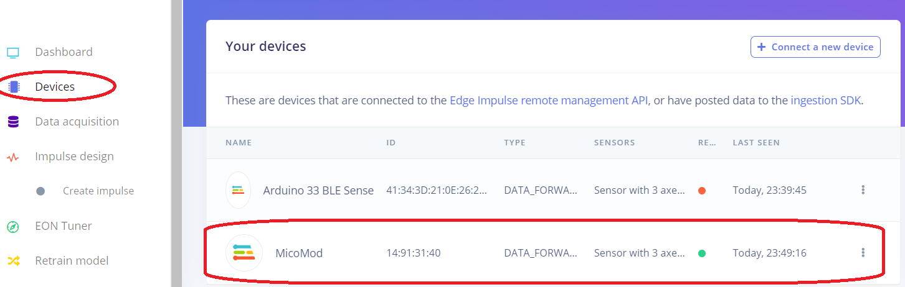
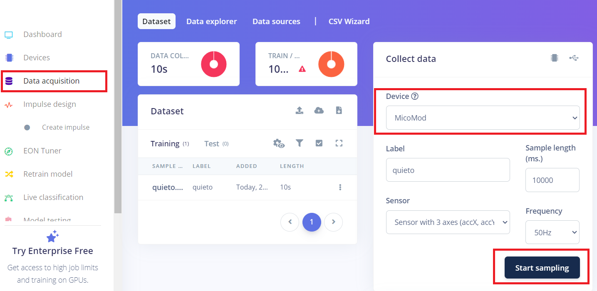

# DataForwarder Tutorial
En este tutorial se muestra un ejemplo de como conectar un microcontrolador MicroMod con Procesador Teensy a la plataforma Edge Impulse. Lo primero es instalar el paquete Edge Impulse CLI.
## Instalacion de Edge Impulse CLI
Los pasos de Instalacion de [Edge Impulse CLI](https://docs.edgeimpulse.com/docs/tools/edge-impulse-cli) estan disponibles en la pagina oficial de la plataforma.
Requerimientos:
* Crear Usuario en la plataforma Edge Impulse.
* Instalar Python 3.0 en el PC o Laptop.
* Instalar NodeJS v16 o superior.

Una vez cumplido con los requesitos, instalamos Edge Impulse CLI ejecutando en una ventada de comandos:
```
npm install -g edge-impulse-cli --force
```
Recordar crear un proyecto en Edge Impulse, en el cual se guardaran las muestras del dispositivo.

## Configuracion de MicroControlador
La configuracion de cada microcontrolador depende de la empresa que lo diseño, en esta asignatura disponemos de
* [Arduino nano 33 BLE Sense](https://docs.edgeimpulse.com/docs/edge-ai-hardware/mcu/arduino-nano-33-ble-sense).
* [Arduino nano 33 BLE Sense rev2](https://docs.arduino.cc/tutorials/nano-33-ble-sense-rev2/imu-accelerometer/).
* SparkFun MicroMod: con CPU [Teensy](https://www.pjrc.com/teensy/tutorial.html) y ESP32 [Link 1](https://github.com/sparkfun/MicroMod_ESP32_Processor) y [Link 2](https://media.digikey.com/pdf/Data%20Sheets/Sparkfun%20PDFs/MicroMod_ESP32_Processor_Board_Hookup_Guide_Web.pdf).

## Uso de DataForwarder de Edge Impulse
La documentacion oficial del [DataForwarder](https://docs.edgeimpulse.com/docs/tools/edge-impulse-cli/cli-data-forwarder) esta disponible en la pagina de Edge Impulse. <br>
Invocamos la aplicacion de DataForwarder en una ventana de comandos:
```
edge-impulse-data-forwarder
```
La primera vez que se ejecuta nos pedira el usuario y la clave.
```
Edge Impulse data forwarder v1.24.0
? What is your user name or e-mail address (edgeimpulse.com)? cristianguarnizo@itm.edu.co
? What is your password? [hidden]
Endpoints:
    Websocket: wss://remote-mgmt.edgeimpulse.com
    API:       https://studio.edgeimpulse.com
    Ingestion: https://ingestion.edgeimpulse.com
```
Luego nos pregunta en que puerto esta conectado el dispositivo, se puede seleccionar con las flechas del teclado:
```
? Which device do you want to connect to? COM9 (Microsoft)
[SER] Connecting to COM9
[SER] Serial is connected (14:91:31:40)
[WS ] Connecting to wss://remote-mgmt.edgeimpulse.com
[WS ] Connected to wss://remote-mgmt.edgeimpulse.com
```
Posteriormente nos permite conectarnos a un proyecto de Edge Impulse, se puede seleccionar con las flechas del teclado:
```
? To which project do you want to connect this device?
Proyecto 1
Proyecto 2
...
Proyecto n
```

A continuacion detecta la frecuencia de muestreo de los datos, y nos pide ponerle un nombre a las variables de los acelerometros.
```
[SER] Detecting data frequency...
[SER] Detected data frequency: 51Hz
? 3 sensor axes detected (example values: [0,-16,1008]). What do you want to call them? Separate the names with ',': accX,AccY,AccZ
```
Finalmente, nos solicita indicar el nombre del Dispositivo para asociarlo al proyecto de Edge Impulso
```
? What name do you want to give this device? MicoMod
[WS ] Device "MicoMod" is now connected to project "Accelerometer_Classification". To connect to another project, run `edge-impulse-data-forwarder --clean`.
[WS ] Go to https://studio.edgeimpulse.com/studio/271892/acquisition/training to build your machine learning model!
```
En la pagina de Edge Impulse, 

## Edge Impulse Platform
Una vez el dispositivo este conectado usando el DataForwarder, entonces vamos a la pagina de Edge Impulse, accedemos al proyecto asociado al microcontrolador, y en seccion de Devices podemos ver los dispositivos conectados al proyecto



En la seccion de Data Acquisition podemos recibir muestras para entrenamiento o test.


